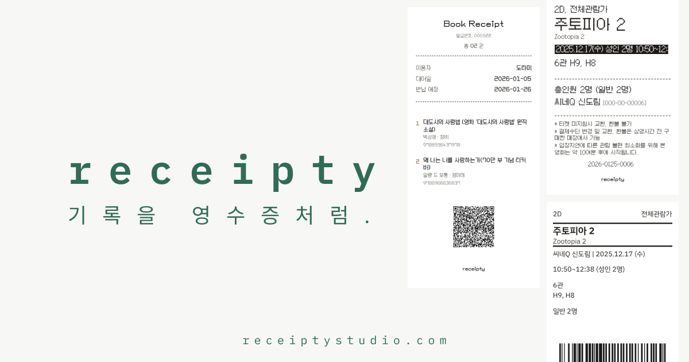

# receipty


취향 기록을 작은 영수증으로 만들고 저장하는 Next.js 웹앱입니다. 로그인 없이 사용할 수 있고, 익명 집계(생성 횟수/인기 항목)만 Supabase에 저장합니다.



## Features

- 도서 영수증/기록 생성
- 영화 영수증/미니 영수증/포토티켓 생성
- 익명 집계 리포트(도서/영화 TOP)
- JPEG 저장(클라이언트 렌더)

## Tech Stack

- Next.js (App Router) + React + TypeScript
- Tailwind CSS v4
- Supabase (public anon key only)

## Getting Started

```bash
npm ci
cp env.example .env.local
npm run dev
```

Open: http://localhost:3000

## Environment Variables

- `NEXT_PUBLIC_SUPABASE_URL`
- `NEXT_PUBLIC_SUPABASE_ANON_KEY`
- `NAVER_CLIENT_ID`, `NAVER_CLIENT_SECRET` (server proxy: `src/app/api/search/route.ts`)
- `NEXT_PUBLIC_GA_ID` (optional)

## Scripts

```bash
npm run dev
npm run build
npm run start
npm run lint
npx tsc -p tsconfig.json --noEmit
```

## Docs

- Supabase setup: `docs/supabase-setup.md`
- Deployment (Vercel): `docs/deployment.md`
- Google Analytics: `docs/google-analytics-setup.md`
- OG image guide: `docs/og-image-guide.md`

## Notes

- DB schema lives in `supabase/schema.sql`.
- Do not commit secrets (`.env*` is gitignored).
